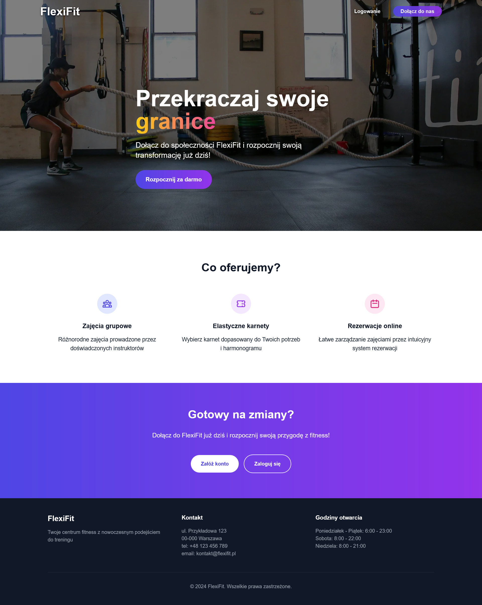
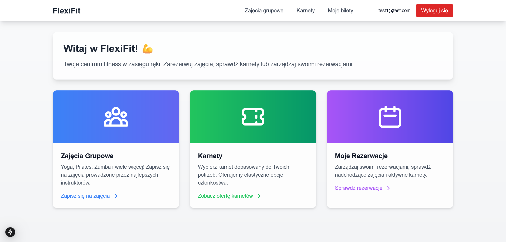
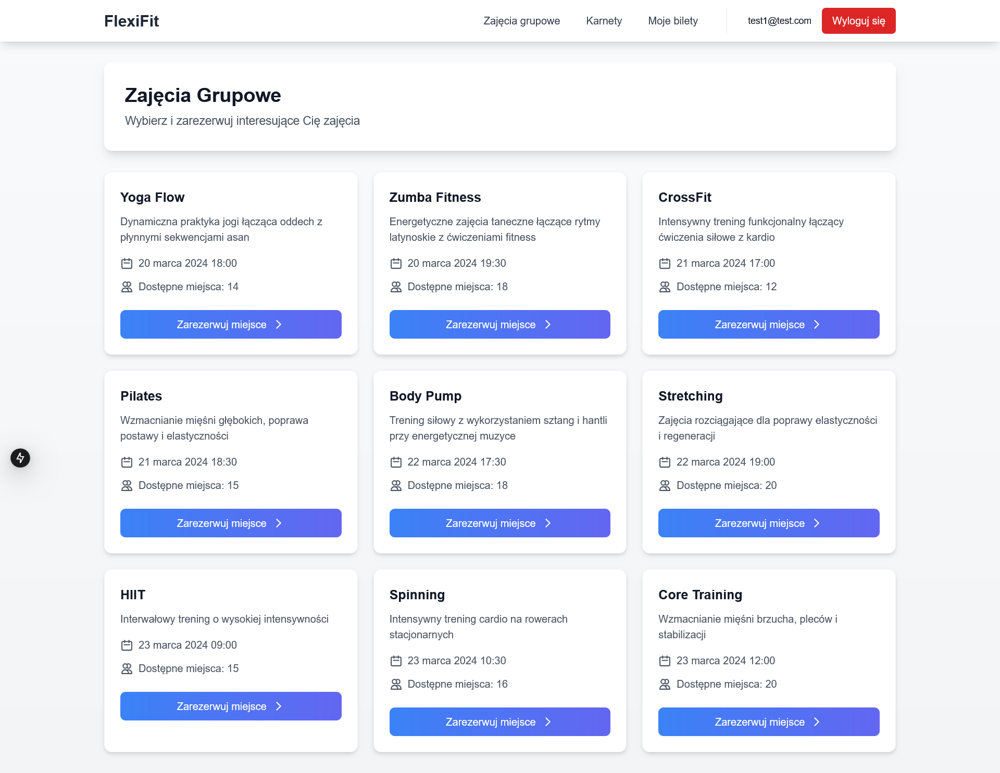
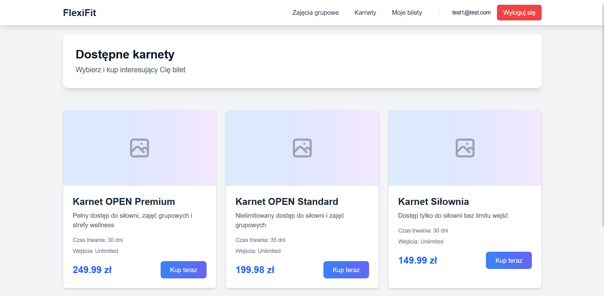
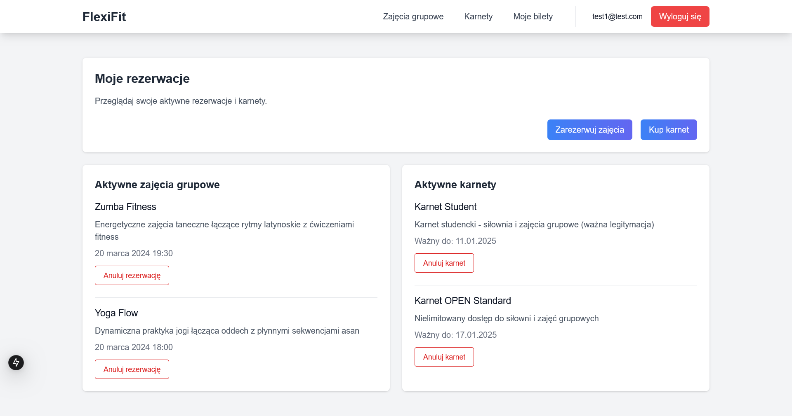

# FlexiFit - System zarządzania siłownią

## Opis projektu

FlexiFit to aplikacja webowa zaprojektowa w celu optymalizacji procesów zarządzania zajęciami sportowymi oraz poprawy jakości obsługi klientów poprzez digitalizację kluczowych funkcji biznesowych. System obsługuje uwierzytelnianie użytkowników, zakup karnetów oraz rezerwacje zajęć grupowych.

### Kluczowe funkcjonalności:

#### Panel Administratora:

- Zarządzanie ofertą karnetów i zajęć grupowych
- Monitorowanie obłożenia zajęć
- Zarządzanie harmonogramem zajęć
- Kontrola dostępu do usług

#### Panel Klienta:

- Intuicyjny system rezerwacji zajęć
- Zakup karnetów online
- Podgląd historii aktywności
- Zarządzanie własnymi rezerwacjami

## Screenshoty

### Strona główna


_Strona powitalna_

### Panel główny


_Panel główny aplikacji z widokiem dostępnych funkcji_

### Zarządzanie zajęciami


_Panel zarządzania zajęciami grupowymi_

### System rezerwacji


_Interfejs rezerwacji zajęć dla klientów_


_Podgląd rezerwacji użytkownika z możliwoscią anulowania aktywnych rezerwacji_

## Wymagania techniczne

### Frontend
- Node.js >= 18.17.0
- Next.js 14.0.0
- TypeScript 5.0
- React 18

### Backend
- Java 21
- Spring Boot 3.4.0
- Spring Security
- MySQL

## Instalacja

### Frontend

1. Sklonuj repozytorium:

```bash
git clone [adres-repozytorium]
```

2. Zainstaluj zależności:

```bash
npm install
```

3. Skonfiguruj zmienne środowiskowe:
   Skopiuj plik `.env.example` do `.env.local` i uzupełnij wymagane wartości:

```bash
cp .env.example .env.local
```

4. Uruchom aplikację w trybie deweloperskim:

```bash
npm run dev
```

Aplikacja będzie dostępna pod adresem: `http://localhost:3000`

### Backend

1. Upewnij się, że masz zainstalowaną Javę 21 i Maven

2. Skonfiguruj bazę danych MySQL

3. Skonfiguruj zmienne środowiskowe w `application.properties`

4. Zainicjalizuj projekt Maven poleceniem:
```bash
mvn clean install
```

5. Uruchom aplikację korzystając z dedykowanego środowiska IDE (np. NetBeans, IntelliJ) lub wykorzystaj polecenie:

```bash
mvn spring-boot:run
```

Backend będzie dostępny pod adresem: `http://localhost:8080`

## Struktura projektu

### Frontend
```
src/
├── app/                  # Główne komponenty stron
├── components/           # Komponenty wielokrotnego użytku
├── hooks/                # Custom hooks
├── lib/                  # Konfiguracja bibliotek
├── types/                # TypeScript types/interfaces
└── utils/                # Funkcje pomocnicze
```

### Backend
```
src/
├── auth/                 # Moduł uwierzytelniania
├── config/              # Konfiguracja aplikacji
├── exception/           # Obsługa błędów
├── groupclass/          # Zarządzanie zajęciami grupowymi
├── service/             # Usługi wspólne
├── ticket/              # Zarządzanie karnetami
└── user/                # Zarządzanie użytkownikami
```

## Technologie

### Frontend:
- Next.js 14 z App Router
- TypeScript
- Tailwind CSS
- React Query

### Backend:
- Spring Boot
- Spring Security (JWT Authentication)
- JPA/Hibernate
- MySQL

### Komunikacja:
- REST API
- Axios
- JWT Authentication

### Bezpieczeństwo:
- Autoryzacja oparta na tokenach JWT
- Bezpieczne przechowywanie haseł
- Konfiguracja CORS
- Globalna obsługa błędów

## Rozwój projektu
...